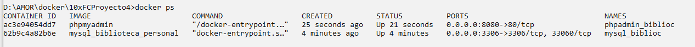

# Proyecto 3 - Construir un contenedor de mysql y su ejecución

## Objetivo

Creación de una base de datos, usuario y password del usuario así como el root
MYSQL_DATABASE=bd_biblioteca \
    MYSQL_USER=user_biblioteca \
    MYSQL_PASSWORD=pass_biblioteca \
    MYSQL_ROOT_PASSWORD=root_pass

- creación de la estructura y su carga inicial
- Comprobación desde mysql
- Comprobación desde VisualStudioCode y/o WorkBech y/o Netbeans

## Crea la siguiente estructura

```txt
10xFCProyecto4/

├── Dockerfile 

└── init/ 

    ├── 1-schema.sql 
    
    └── 2-datos.sql
```

## Clonar repositorio

```git
git clone url
```

Cambia al directorio donde se ha clonado.

```bash
cd nombreCarpeta
```

## Definir una network bridge

```docker
docker network create mi_red
```

## Desde la raíz del proyecto, construye la imagen

```docker
docker build -t mysql_biblioteca_personal .
```

## Ejecutar el contenedor con MySQL indicamos que está en la red --network mi-red

``` docker
docker run -d  --rm --name mysql_biblioc --network mi_red  -p 3306:3306 -v mysql_data_biblio:/var/lib/mysql mysql_biblioteca_personal
```

### Comprobación del contenedor en ejecución (running o up)


## Crear un contenedor phpMyAdmin indicando que este --network mi-red

> *phpMyAdmin* es una herramienta web escrita en PHP que permite **administrar bases de datos MySQL o MariaDB** a  través de un interfaz gráfico fácil de usar, en lugar de hacerlo desde línea de comandos.
>
> Variable de entorno **PMA_HOST=mysql_biblioc** es un argumento que se utiliza en la ejecución de contenedores Docker, especialmente cuando se usa una imagen phpMyadmin.
>
> **PMA_HOST**: se especifica el host del servidor MySQL o MariaDB al que phpMyAdmin debe conectarse.

Con el siguiente comando creamos el conteneodr phpadmin_biblioc:

```docker
docker run -d --rm --name phpadmin_biblioc --network mi_red -e PMA_HOST=mysql_biblioc -p 8080:80 phpmyadmin
```


## Comprobar que los dos contenedores en ejecución 



## Mostrar volumen


### Mostrar network


### Usar base de datos, que tablas y su contenido


### Cliente MySQL: WorkBench, Visual Studio Code y  con http://localhost:8080


## Mostrar la base de datos bd_biblioteca
